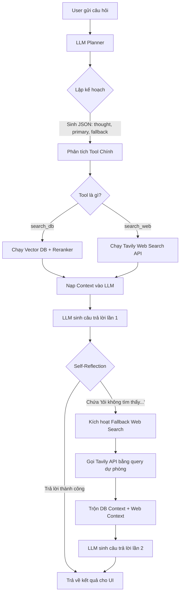

# Kiến trúc & Luồng hoạt động của HCMUT RAG Agent

Tài liệu này mô tả chi tiết cơ chế hoạt động của Agent tư vấn tuyển sinh Đại học Bách Khoa TP.HCM (HCMUT). 

Thay vì sử dụng luồng RAG cơ bản (Hỏi -> Tìm Vector -> Trả lời), hệ thống hiện tại đã được nâng cấp lên chuẩn **Agentic RAG**, kết hợp giữa 2 mô hình thiết kế nổi tiếng là **Plan-and-Execute** (Lên kế hoạch và Thực thi) và **Adaptive RAG / Self-Reflection** (Tự đánh giá).

---

## 1. Luồng Tổng Quan (The Flow)

Mỗi khi người dùng đặt một câu hỏi, Agent sẽ lần lượt đi qua các bước sau:

### Bước 1: Lập kế hoạch (Planning)
- **Input:** Câu hỏi của người dùng (`query`).
- **Process:** LLM đóng vai trò là Planner. Nó được cấp cấu trúc định dạng JSON (`Plan`) và danh sách các Tool có sẵn (`search_db`, `search_web`). 
- **Output:** LLM sẽ tự sinh ra:
  - `thought`: Suy luận của LLM xem nên dùng tool nào, lý do tại sao.
  - `primary_action`: Hành động ưu tiên số 1 (Ví dụ: Tra DB).
  - `fallback_action`: Hành động dự phòng nếu hành động chính fail.

### Bước 2: Thực thi Tool chính (Primary Execution)
- Hệ thống bóc tách `primary_action` và gọi hàm tương ứng.
- **Nếu là `search_db`:** Gọi Reranker chấm điểm và lấy ra top các tài liệu (chunks) liên quan nhất từ Database.
- **Nếu là `search_web`:** Gọi thẳng Tavily API để cào dữ liệu từ Internet (dùng cho các câu hỏi nấu ăn, chính trị hoặc sự kiện tương lai).

### Bước 3: Sinh câu trả lời lần 1 & Chặn Ảo giác (1st Generation & Anti-hallucination)
- Hệ thống đẩy `contexts` lấy được ở Bước 2 cùng câu hỏi của user vào một Prompt cực kỳ khắt khe:
  > *"Chỉ sử dụng thông tin tham khảo. TUYỆT ĐỐI KHÔNG bịa đặt. Nếu không có thông tin, bắt buộc phải trả lời: 'tôi không tìm thấy thông tin này trong cơ sở dữ liệu'."*
- LLM sẽ đọc kỹ Context. Nếu thực sự có đáp án, nó trả lời bình thường. Kết thúc luồng!
- Nhưng nếu nó phát hiện Context bị thiếu (mặc dù điểm Reranker có thể rất cao do trùng keyword), nó sẽ tuân thủ luật và nói: *"Tôi không tìm thấy..."*.

### Bước 4: Tự Kiểm Điểm & Kích Hoạt Dự Phòng (Self-Reflection & Fallback)
- **Cơ chế:** Thay vì dùng điểm số máy móc (như score của Reranker) để đánh giá độ tin cậy, Agent dùng chính câu trả lời của LLM để làm mốc đánh giá.
- Nếu câu trả lời có chứa cụm *"không tìm thấy"*, hệ thống lập tức hiểu rằng: *"À, Database bị thiếu thông tin rồi, phải mở rộng nguồn tìm kiếm thôi!"*.
- Lúc này, hệ thống sẽ móc lệnh `fallback_action` ra (Thường là `search_web`) và nối thêm các keyword an toàn như *"Đại học Bách Khoa TP.HCM"* vào để chống đi lạc chủ đề.

### Bước 5: Cào Dữ Liệu Web (Tavily Web Search)
- Gọi Tavily API với cờ `search_depth="advanced"` và `include_answer=True`.
- Kết quả thu về bao gồm:
  1. Câu trả lời tóm tắt đã được AI của Tavily chắt lọc.
  2. Text nguyên bản (raw context) của 3 bài viết uy tín nhất.
- Nối các context web này vào các context DB trước đó để tạo thành một kho tư liệu khổng lồ.

### Bước 6: Tổng Hợp Chốt Hạ (2nd Generation)
- Nạp lại toàn bộ kho tư liệu mới (DB + Web) vào Prompt.
- LLM tiến hành sinh câu trả lời lần 2. Lần này, nó sẽ có đầy đủ dữ kiện về các năm 2024, 2025, 2026 hoặc các thông tin mới nhất trên mạng để giải đáp chính xác.

---

## 2. Ưu Điểm Của Kiến Trúc Này

1. **Siêu chính xác (High Accuracy):** Vì dùng chính LLM để đọc text và kết luận xem có nên Fallback không (Self-Reflection), nó khắc phục hoàn toàn điểm mù của Reranker.
2. **An toàn (Safe Bounds):** Nhờ luật ép trong prompt, Bot sẽ không bao giờ trả lời những câu hỏi tào lao ngoài luồng (cách luộc trứng, giá vàng...) vì dù Web có tìm ra công thức luộc trứng, LLM cũng sẽ từ chối trả lời vì nó không liên quan đến Bách Khoa.
3. **Mượt mà về UI:** Ở phía giao diện (`app/streamlit_agent.py`), người dùng có thể chiêm ngưỡng toàn bộ "não bộ" của Agent hoạt động (phần `thought` của LLM) giống hệt cách Claude hay ChatGPT thực hiện quá trình Thinking, mang lại cảm giác cực kỳ tin cậy và chuyên nghiệp.

---

## 3. Sơ Đồ Luồng (Flowchart)

Sơ đồ dưới đây mô tả chính xác quá trình tương tác giữa User, Agent Planner, Tools (DB/Web), và quá trình Self-Reflection.

---

## 4. Cách Hiện Thực (Implementation Details)

1. **Schema Định nghĩa LLM Output (Pydantic):**
   - Sử dụng `pydantic.BaseModel` để ép LLM trả về cấu trúc JSON nghiêm ngặt.
   - Lớp `Plan` chứa `thought` (string), `primary_action` (Action), `fallback_action` (Action). Điều này đảm bảo LLM không bao giờ trả về rác.

2. **Gọi LLM bằng Google GenAI SDK (Phiên bản mới):**
   - Đẩy Pydantic Schema vào qua tham số `config={"response_mime_type": "application/json", "response_schema": Plan}` để SDK tự động Parse thành JSON hợp lệ.

3. **Cơ Chế Self-Reflection (Tự phản tỉnh):**
   - **System Prompt:** Ép cứng luật - Nếu thiếu thông tin, bắt buộc in ra dòng chữ `"Tôi không tìm thấy thông tin này trong cơ sở dữ liệu."` (Tạo cờ hiệu).
   - **Agent Logic:** Hệ thống code Python bắt cờ hiệu này bằng lệnh `if "không tìm thấy" in answer.lower():` để tự động kích hoạt ngầm lệnh tìm Web.

4. **Tích hợp giao diện UI suy luận (Streamlit):**
   - Dùng hàm custom `@contextlib.contextmanager` kèm `io.StringIO` để chụp toàn bộ luồng log `sys.stdout` chạy ngầm.
   - Dùng Regex (`re.search` hoặc `split`) bóc tách riêng mảng JSON.
   - Gắn `thought` vào thành phần `st.status("Đang suy nghĩ...")` của Streamlit, tự động cập nhật trạng thái đóng nắp (collapsed) thành "Suy nghĩ xong" sau khi load kết quả y hệt hành vi của Claude.

---

## 5. Phân Tích Chi Phí & Số Lượng API Calls (Operational Metrics)

Mô hình Agentic RAG này phải đánh đổi số lượng request API để lấy lại sự chính xác tuyệt đối. Dưới đây là thống kê số lượng API được gọi ra ngoài cho 1 câu hỏi của người dùng:

**Kịch bản 1: Tối ưu nhất (DB có sẵn đáp án - Best Case)**
- **1 call** Gemini API (Lập kế hoạch).
- **1 call** Embedding API (Chuyển câu hỏi thành vector).
- Reranker chạy Local (Miễn phí / 0 API call).
- **1 call** Gemini API (Sinh câu trả lời lần 1 và thành công).
=> **Tổng cộng:** 2 LLM calls + 1 Embedding call. Không tốn phí Web Search.

**Kịch bản 2: Xấu nhất (DB không có, phải Fallback Web - Worst Case)**
- **1 call** Gemini API (Lập kế hoạch).
- **1 call** Embedding API (Tìm DB).
- **1 call** Gemini API (Sinh câu trả lời lần 1 - nhưng phát hiện thiếu dữ liệu).
- **1 call** Tavily API (Cào dữ liệu Web).
- **1 call** Gemini API (Sinh câu trả lời lần 2 tổng hợp từ cả DB + Web).
=> **Tổng cộng:** 3 LLM calls + 1 Embedding call + 1 Web Search call. 

**Kịch bản 3: Agent chọn Web ngay từ đầu (Direct Web)**
- **1 call** Gemini API (Lập kế hoạch).
- **1 call** Tavily API (Cào dữ liệu Web).
- **1 call** Gemini API (Sinh câu trả lời).
=> **Tổng cộng:** 2 LLM calls + 1 Web Search call.

> **Đánh giá chung:** So với luồng RAG cơ bản (chỉ tốn 1 Embedding + 1 LLM call), Agent này tiêu thụ lượng API gấp **2 đến 3 lần**. Bù lại, hệ thống có khả năng tự sửa sai, chặn đứng ảo giác và tự chủ động đi tìm thông tin khuyết thiếu mà RAG truyền thống không thể làm được.
